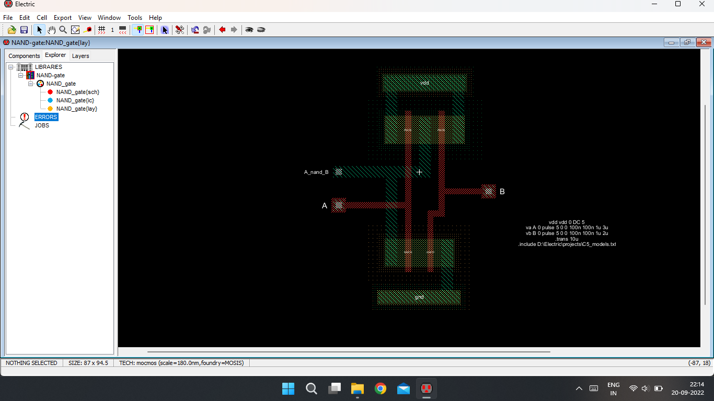
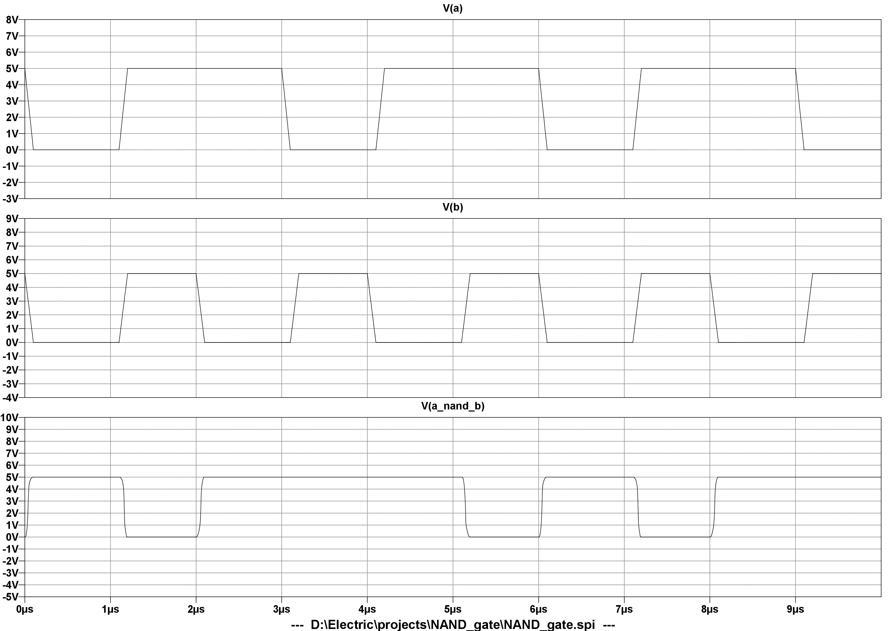
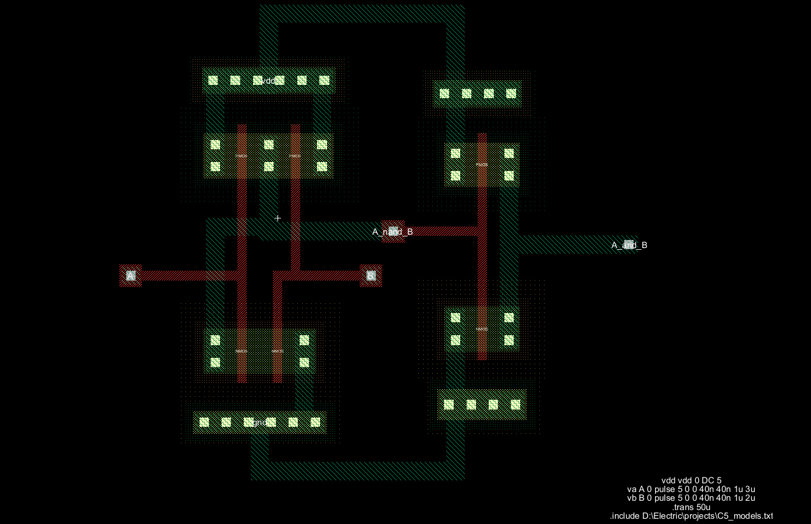
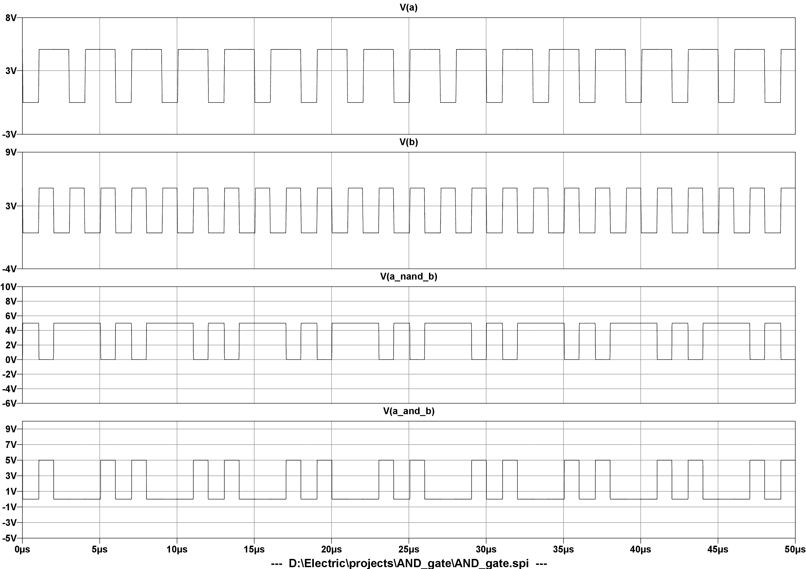

# LogicGates_IC_layout


Repository of Schematic diagram , SSI layout , simulation graph of Logic gates and IC 

> Basically I am using Electric VLSI design system to design Logic gates and IC's schematic diagram and layouts. <br>
> I always simulate all the things in LTSpice XVII software to get or check the output is correct or not.

<pre>  </pre>
  <a href="https://en.wikipedia.org/wiki/Electric_(software)" target="_blank">
    
  </a>
  Electric VLSI Design System
  <br><br>
 <a href="https://www.analog.com/en/design-center/design-tools-and-calculators/ltspice-simulator.html" target="_blank">
   
</a>
  LTSpice XVII
  <br><br>
  
> N.B : Make sure that you have installed Jdk first. Electric VLSI needs java run time Environment to operate.


I will update this repository as soon as possible.
## Here is basic info about this gates and ICs

<div align="center">
  
# NOR Gate
  

 Design with CMOS
  
  
  </div>
  
If you want to know about NOR gate [click here](https://en.wikipedia.org/wiki/NOR_gate)
  
<div align="left">
  
## Screenshots of Project
  
</div>
  
  

  
layout design of NOR gate (Electric vlsi)
  
<br>

  
Simulation of NOR gate (LTSpice XVII)
  
<div align="left">
  
### Important


During this Simulation you need to provide input signal or spice code
this code is here,
  
  ```bash
vdd vdd 0 DC 5
va A 0 DC pwl 10n 0 20n 5 50n 5 60n 0 90n 0 100n 5 130n 5 140n 0 170n 0 180n 5
vb B 0 DC pwl 10n 0 20n 5 100n 5 110n 0
.measure tran tf trig v(AnorB) val=4.5 fall=1 td=4ns trag v(AnorB) val=0.5 fall=1
.measure tran tr trig v(AnorB) val=0.5 rise=1 td=4ns trag v(AnorB) val=4.5 rise=1
.tran 200n
.include D:\Electric\projects\C5_models.txt
  ```

<div align="center">

# NOT Gate

Design with CMOS


</div>

If you want to know about NOR gate [click here](https://en.wikipedia.org/wiki/Inverter_(logic_gate))

## Screenshots of Project


layout design of NOT gate (Electric vlsi)

<br>


simulation of NOT gate (LTSpice XVII)


### Important

spice code

```bash
vdd vdd 0 DC 5
vin A 0 pulse 5 0 0 300n 300n 2u 4u
.trans 10u
.include D:\Electric\projects\C5_models.txt
```
<br>

<div align="center">

# NAND Gate

Design with CMOS


</div>

If you want to know about NAND gate [click here](https://en.wikipedia.org/wiki/NAND_gate)

## Screenshots of Project



layout design of NAND gate (Electric vlsi)

<br>



simulation of NAND gate (LTSpice XVII)

### Important

**spice code**

```bash
vdd vdd 0 DC 5
va A 0 pulse 5 0 0 100n 100n 1u 3u
vb B 0 pulse 5 0 0 100n 100n 1u 2u
.trans 10u
.include D:\Electric\projects\C5_models.txt
```
<br>

<div align="center">

# AND Gate

Design with CMOS


</div>

If you want to know about NAND gate [click here](https://en.wikipedia.org/wiki/AND_gate)

## Screenshots of Project



layout design of NAND gate (Electric vlsi)

<br>



simulation of NAND gate (LTSpice XVII)


> If you will face any type of problems, feel free to ask <br>
> And <br>
> Be aware from layout shorts and DRC-ERC errors.😁
  
## All the best
  
</div>
